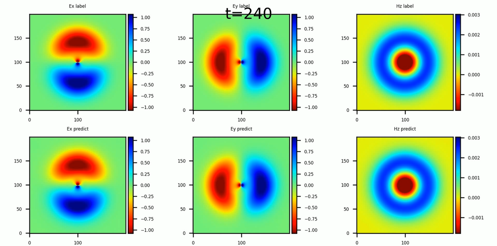

# 目录

- [目录](#目录)
- [麦克斯韦方程组](#麦克斯韦方程组)
- [AI求解点源麦克斯韦方程组](#ai求解点源麦克斯韦方程组)
- [数据集](#数据集)
- [特性](#特性)
    - [混合精度](#混合精度)
- [环境要求](#环境要求)
- [脚本说明](#脚本说明)
    - [脚本及样例代码](#脚本及样例代码)
    - [脚本参数](#脚本参数)
- [模型描述](#模型描述)
- [模型训练](#模型训练)
    - [训练性能与精度](#训练性能与精度)
- [模型推理](#模型推理)
    - [推理性能与精度](#推理性能与精度)
- [随机情况说明](#随机情况说明)
- [MindScience主页](#mindscience主页)

# 麦克斯韦方程组

麦克斯韦方程组一组描述电场、磁场与电荷密度、电流密度之间关系的偏微分方程，有激励源的控制方程具体描述如下：

$$
\nabla\times E=-\mu \dfrac{\partial H}{\partial t},
$$
$$
\nabla\times H=\epsilon \dfrac{\partial E}{\partial t} + J(x, t)
$$

其中$\epsilon,\mu$分别是介质的绝对介电常数、绝对磁导率。$J(x, t)$是电磁仿真过程中的激励源，常用的加源方式包括点源，线源和面源，本案例主要考虑点源的形式，数学上表示为：
$$
J(x, t)=\delta(x - x_0)g(t)
$$

# AI求解点源麦克斯韦方程组

AI求解点源麦克斯韦方程组的整体网络架构如下：


以二维点源麦克斯韦方程组为例，网络输入为$\Omega=(x, y, t)\in [0,1]^3$, 输出为方程的解$u=(E_x, E_y, H_z)$。基于网络的输出和MindSpore框架的自动微分功能，训练损失函数来自于控制方程(PDE loss)，初始条件(IC loss)和边界条件(BC loss)三部分。这里我们采用电磁场为0的初始值，边界采用二阶Mur吸收边界条件。由于激励源的存在，我们将PDE loss的计算分为两部分：激励源附近区域$\Omega_0$与非激励源区域$\Omega_1$。最终我们整体的损失函数可以表示为：
$$L_{total} = \lambda_{src}L_{src} + \lambda_{src_ic}L_{src_ic} + \lambda_{no_src}L_{no_src} + \lambda_{no_src_ic}L_{no_src_ic} +  \lambda_{bc}L_{bc} $$
其中$\lambda$s表示各项损失函数的权重。为了降低权重选择的难度，我们采用了自适应加权的算法，具体参见我们的论文。

# 数据集

- 训练数据：基于五个损失函数，我们分别对有源区域，无源区域，边界，初始时刻进行随机采点，作为网络的输入。
- 评估数据：我们基于传统的时域有限差分算法生成高精度的电磁场。
    - 注：数据在src/dataset.py中处理。

# 特性

## 混合精度

采用[混合精度](https://www.mindspore.cn/docs/programming_guide/zh-CN/master/enable_mixed_precision.html)的训练方法使用支持单精度和半精度数据来提高深度学习神经网络的训练速度，同时保持单精度训练所能达到的网络精度。混合精度训练提高计算速度、减少内存使用的同时，支持在特定硬件上训练更大的模型或实现更大批次的训练。

以FP16算子为例，如果输入数据类型为FP32，MindSpore后台会自动降低精度来处理数据。用户可打开INFO日志，搜索“reduce precision”查看精度降低的算子。

# 环境要求

- 硬件（Ascend）
    - 准备Ascend处理器搭建硬件环境。
- 框架
    - [MindElec](https://www.mindspore.cn/install)
- 如需查看详情，请参见如下资源：
    - [MindElec教程](https://www.mindspore.cn/tutorials/zh-CN/master/index.html)
    - [MindElec Python API](https://www.mindspore.cn/docs/api/zh-CN/master/index.html)

# 脚本说明

## 脚本及样例代码

```path
.
└─Maxwell
  ├─README.md
  ├─figure                            # README示意图
  ├─src
    ├──dataset.py                     # 数据集配置
    ├──maxwell.py                     # 点源麦克斯韦方程定义
    ├──lr_scheduler.py                # 学习率下降方式
    ├──callback.py                    # 回调函数
    ├──sampling_config.py             # 随机采样数据集的参数配置文件
    ├──utils.py                       # 功能函数
  ├──train.py                         # 训练脚本
  ├──eval.py                          # 推理和评估脚本
  ├──config.json                      # 训练参数和评估数据参数
```

## 脚本参数

数据集采样控制参数在src/sampling_config.py文件中配置如下：

```python
src_sampling_config = edict({         # 有源区域的采样配置
    'domain': edict({                 # 内部点空间采样配置
        'random_sampling': True,      # 是否随机采样
        'size': 65536,                # 采样样本数目
        'sampler': 'uniform'          # 随机采样方式
    }),
    'IC': edict({                     # 初始条件样本采样配置
        'random_sampling': True,      # 是否随机采样
        'size': 65536,                # 采样样本数目
        'sampler': 'uniform',         # 随机采样方式
    }),
    'time': edict({                   # 时间采样配置
        'random_sampling': True,      # 是否随机采样
        'size': 65536,                # 采样样本数目
        'sampler': 'uniform',         # 随机采样方式
    }),
})

no_src_sampling_config = edict({      # 无源区域的采样配置
    'domain': edict({                 # 内部点空间采样配置
        'random_sampling': True,      # 是否随机采样
        'size': 65536,                # 采样样本数目
        'sampler': 'uniform'          # 随机采样方式
    }),
    'IC': edict({                     # 初始条件样本采样配置
        'random_sampling': True,      # 是否随机采样
        'size': 65536,                # 采样样本数目
        'sampler': 'uniform',         # 随机采样方式
    }),
    'time': edict({                   # 时间采样配置
        'random_sampling': True,      # 是否随机采样
        'size': 65536,                # 采样样本数目
        'sampler': 'uniform',         # 随机采样方式
    }),
})

bc_sampling_config = edict({          # 边界区域的采样配置
    'BC': edict({                     # 边界点空间采样配置
        'random_sampling': True,      # 是否随机采样
        'size': 65536,                # 采样样本数目
        'sampler': 'uniform',         # 随机采样方式
        'with_normal': False          # 是否需要边界法向向量
    }),
    'time': edict({                   # 时间采样配置
        'random_sampling': True,      # 是否随机采样
        'size': 65536,                # 采样样本数目
        'sampler': 'uniform',         # 随机采样方式
    }),
})
```

模型训练及控制参数在config.json文件中配置如下：

```python
{
    "Description" : [ "PINNs for solve Maxwell's equations" ], # 案例描述
    "Case" : "2D_Mur_Src_Gauss_Mscale_MTL",                    # 案例标记
    "random_sampling" : true,                                  # 样本集是否通过随机采样生成，如果为false则加载离线生成的数据集
    "coord_min" : [0, 0],                                      # 矩形计算域x和y轴最小坐标
    "coord_max" : [1, 1],                                      # 矩形计算域x和y轴最大坐标
    "src_pos" : [0.4975, 0.4975],                              # 点源位置坐标
    "src_frq": 1e+9,                                           # 激励源主频率
    "range_t" : 4e-9,                                          # 模拟时长
    "input_scale": [1.0, 1.0, 2.5e+8],                         # 网络输入坐标的缩放系数
    "output_scale": [37.67303, 37.67303, 0.1],                 # 网络输出物理量的缩放系数
    "src_radius": 0.01,                                        # 高斯平滑后的点源范围半径大小
    "input_size" : 3,                                          # 网络输入维度
    "output_size" : 3,                                         # 网络输出维度
    "residual" : true,                                         # 网络结构是否包含残差模块
    "num_scales" : 4,                                          # 多尺度网络的子网数目
    "layers" : 7,                                              # 全连接网络层数(输入、输出加隐藏层)
    "neurons" : 64,                                            # 隐层神经元个数
    "amp_factor" : 10,                                         # 网络输入的放大因子
    "scale_factor" : 2,                                        # 多尺度网络的各子网放大系数
    "save_ckpt" : true,                                        # 训练中是否保存checkpoint信息
    "load_ckpt" : false,                                       # 是否加载权重进行增量训练
    "train_with_eval": false                                    # 是否边训练边推理
    "save_ckpt_path" : "./ckpt",                               # checkpoint保存路径
    "load_ckpt_path" : "",                                     # 加载checkpoint的文件路径
    "train_data_path" : "",                                    # 加载离线训练数据集的路径
    "test_data_path" : "",                                     # 加载离线测试数据集的路径
    "lr" : 0.002,                                              # 初始学习率
    "milestones" : [2000, 4000, 5000],                         # 学习率衰减的里程碑
    "lr_gamma" : 0.1,                                          # 学习率衰减系数
    "train_epoch" : 6000,                                      # 迭代训练数据集的次数
    "train_batch_size" : 8192,                                 # 网络训练的批数据大小
    "test_batch_size" : 32768,                                 # 网络推理的批数据大小
    "predict_interval" : 150,                                  # 边训练边推理的迭代间隔步数
    "vision_path" : "./vision",                                # 可视化结果保存路径
    "summary_path" : "./summary"                               # mindinsight summary结果保存路径
}
```

# 模型描述

本案例采用多通道残差网络结合Sin激活函数的网络架构。


# 模型训练

您可以通过train.py脚本训练参数化电磁仿真模型，训练过程中模型参数会自动保存：

```python
python train.py
```

## 训练性能与精度

脚本提供了边训练边评估的功能，网络训练的损失函数、性能数据以及精度评估结果如下：

```python
epoch: 1 step: 8, loss is 11.496931
epoch time: 185.432 s, per step time: 23178.955 ms
epoch: 2 step: 8, loss is 9.000967
epoch time: 0.511 s, per step time: 63.926 ms
epoch: 3 step: 8, loss is 8.101629
epoch time: 0.490 s, per step time: 61.248 ms
epoch: 4 step: 8, loss is 7.4107575
epoch time: 0.490 s, per step time: 61.230 ms
epoch: 5 step: 8, loss is 7.0657954
epoch time: 0.484 s, per step time: 60.477 ms
epoch: 6 step: 8, loss is 6.894913
epoch time: 0.482 s, per step time: 60.239 ms
epoch: 7 step: 8, loss is 6.6508193
epoch time: 0.482 s, per step time: 60.297 ms
epoch: 8 step: 8, loss is 6.316092
epoch time: 0.483 s, per step time: 60.343 ms
epoch: 9 step: 8, loss is 6.264338
epoch time: 0.484 s, per step time: 60.463 ms
epoch: 10 step: 8, loss is 6.113656
epoch time: 0.483 s, per step time: 60.392 ms
...
epoch: 5990 step: 8, loss is 0.7306183
epoch time: 0.485 s, per step time: 60.684 ms
epoch: 5991 step: 8, loss is 0.7217314
epoch time: 0.484 s, per step time: 60.559 ms
epoch: 5992 step: 8, loss is 0.7106861
epoch time: 0.483 s, per step time: 60.399 ms
epoch: 5993 step: 8, loss is 0.7238727
epoch time: 0.484 s, per step time: 60.520 ms
epoch: 5994 step: 8, loss is 0.72685266
epoch time: 0.486 s, per step time: 60.735 ms
epoch: 5995 step: 8, loss is 0.7518991
epoch time: 0.485 s, per step time: 60.613 ms
epoch: 5996 step: 8, loss is 0.7451218
epoch time: 0.482 s, per step time: 60.308 ms
epoch: 5997 step: 8, loss is 0.74497545
epoch time: 0.483 s, per step time: 60.313 ms
epoch: 5998 step: 8, loss is 0.72911096
epoch time: 0.483 s, per step time: 60.425 ms
epoch: 5999 step: 8, loss is 0.7317751
epoch time: 0.485 s, per step time: 60.591 ms
epoch: 6000 step: 8, loss is 0.71511096
epoch time: 0.485 s, per step time: 60.580 ms
==========================================================================================
l2_error, Ex:  0.03556711707787814 , Ey:  0.03434167989333677 , Hz:  0.022974221345851673
==========================================================================================
```

Mindinsight同样提供了实时可视化精度曲线的功能。在网页打开收集的summary文件，随着训练的进行，Ex/Ey/Hz的误差曲线如下图所示：


# 模型推理

您可以通过eval.py脚本加载测试数据集进行推理，并获取推理精度：

```python
python eval.py
```

## 推理性能与精度

```python
predict total time: 40.59165406227112 s
l2_error, Ex:  0.03556711707787814 , Ey:  0.03434167989333677 , Hz:  0.022974221345851673
```

瞬时电磁场的分布与FDTD标签数据的对比云图如下所示：



# 随机情况说明

train.py中设置了随机种子，网络输入通过均匀分布随机采样。

# MindScience主页

请浏览官网[主页](https://gitee.com/mindspore/mindscience)。
