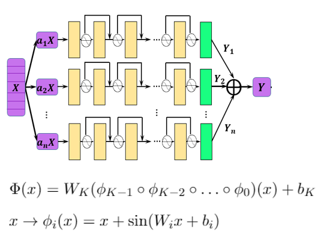
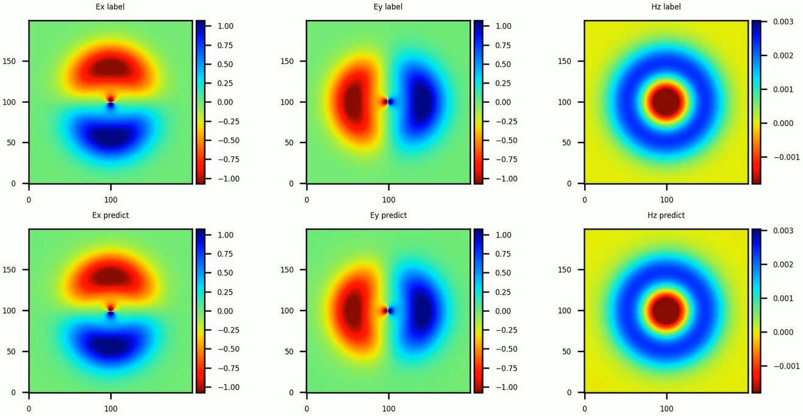

# Contents

- [Contents](#contents)
- [Maxwell's Equations](#maxwells-equations)
- [AI Solver of Maxwell's Equations with Point Source](#ai-solver-of-maxwells-equations-with-point-source)
- [Datasets](#datasets)
- [Environment Requirements](#environment-requirements)
- [Script Description](#script-description)
    - [Script and Sample Code](#script-and-sample-code)
    - [Script Parameters](#script-parameters)
- [Model Architecture](#model-architecture)
- [Training](#training)
    - [Training Performance and Accuracy](#training-performance-and-accuracy)
- [Evaluation](#evaluation)
    - [Evaluation Performance and Accuracy](#evaluation-performance-and-accuracy)
- [Description of Random Situation](#description-of-random-situation)
- [MindScience Home Page](#mindscience-home-page)

# Maxwell's Equations

Maxwell's equations are a set of partial differential equations that describe how electric and magnetic fields are generated by charges and currents of the fields. The governing equations with excitation sources are described as follows:
$$
\nabla\times E=-\mu \dfrac{\partial H}{\partial t},
$$
$$
\nabla\times H=\epsilon \dfrac{\partial E}{\partial t} + J(x, t)
$$

The constants $\mu$ and $\epsilon$ are known as the permeability and permittivity of the free space, respectively.
$J(x, t)$ represents a known excitation source function. Common excitation sources include point source, line source, and area source. In this tutorial, point source is considered, of which mathematical description can be expressed as follows:
$$
J(x, t)=\delta(x - x_0)g(t)
$$

# AI Solver of Maxwell's Equations with Point Source

The overall network architecture for AI solution to point source Maxwell equations is as follows:


Taking two-dimensional point source Maxwell equations as an example, the network input is $\Omega=(x, y, t)\in [0,1]^3$, and the output is $u=(E_x, E_y, H_z)$ . Based on the output of the network and the automatic differential mechanism of MindSpore, the loss functions required for network training can be constructed. The loss function consists of three parts: governing equations (PDE loss), initial condition (IC loss), and boundary condition (BC loss). The initial electromagnetic field is set to be zeros, and the strandard Mur's second-order absorbing boundary condition is utilized on the boundaries. Due to the existence of the excitation source, we divide the PDE loss into two parts: the region near the excitation source $\Omega_0$ and the region without the excitation source $\Omega_1$. Ultimately, our overall loss function can be expressed as follows:
$$L_{total} = \lambda_{src}L_{src} + \lambda_{src_ic}L_{src_ic} + \lambda_{no_src}L_{no_src} + \lambda_{no_src_ic}L_{no_src_ic} +  \lambda_{bc}L_{bc} $$
where $\lambda$s indicates the weight of each loss function. In order to reduce the difficulty of weight selection, we adopt the adaptive weighting algorithm.

# Datasets

- Training data: Based on five loss functions, we randomly pick points for the source region, no source region, boundary, and initial condition, respectively, as the input of the network.
- Evaluation data: We generate high-precision electromagnetic fields based on traditional finite-difference time-domain algorithms.
    - Note: Data is processed in src/dataset.py.

# Environment Requirements

- Hardware (Ascend)
    - Prepare the Ascend AI Processor to set up the hardware environment.
- Framework
    - [MindElec](https://gitee.com/mindspore/mindscience/tree/master/MindElec)
- For more information, see the following resources:
    - [MindElec Tutorial](https://www.mindspore.cn/mindscience/docs/en/master/mindelec/intro_and_install.html)
    - [MindElec Python API](https://www.mindspore.cn/mindscience/api/en/master/mindelec.html)

# Script Description

## Script and Sample Code

```path
.
└─Maxwell
  ├─README.md
  ├─docs                              # schematic diagram of README
  ├─src
    ├──dataset.py                     # configuration of dataset
    ├──maxwell.py                     # definitions of Maxwell's Equations with point source
    ├──lr_scheduler.py                # learning-rate decay scheduler
    ├──callback.py                    # callback functions
    ├──sampling_config.py             # parameter profile for randomly sampled datasets
    ├──utils.py                       # auxiliary functions
  ├──train.py                         # training script
  ├──eval.py                          # evaluation script
  ├──config.json                      # training and evaluation parameters
```

## Script Parameters

The dataset sampling control parameters are set in the `src/sampling_config.py` file as follows:

```python
src_sampling_config = edict({         # sampling configuration of the near-source region
    'domain': edict({                 # sampling configuration of domain points
        'random_sampling': True,      # whether sampling randomly
        'size': 65536,                # number of sampled points
        'sampler': 'uniform'          # random sampling manner
    }),
    'IC': edict({                     # sampling configuration of initial boundary points
        'random_sampling': True,      # whether sampling randomly
        'size': 65536,                # number of sampled points
        'sampler': 'uniform',         # random sampling manner
    }),
    'time': edict({                   # sampling configuration of time
        'random_sampling': True,      # whether sampling randomly
        'size': 65536,                # number of sampled points
        'sampler': 'uniform',         # random sampling manner
    }),
})

no_src_sampling_config = edict({     # sampling configuration of the region without source
    'domain': edict({                # sampling configuration of domain points
        'random_sampling': True,     # whether sampling randomly
        'size': 65536,               # number of sampled points
        'sampler': 'uniform'         # random sampling manner
    }),
    'IC': edict({                    # sampling configuration of initial boundary points
        'random_sampling': True,     # whether sampling randomly
        'size': 65536,               # number of sampled points
        'sampler': 'uniform',        # random sampling manner
    }),
    'time': edict({                  # sampling configuration of time
        'random_sampling': True,     # whether sampling randomly
        'size': 65536,               # number of sampled points
        'sampler': 'uniform',        # random sampling manner
    }),
})

bc_sampling_config = edict({          # sampling configuration of boundary points
    'BC': edict({                     # spatial sampling configuration of boundary
        'random_sampling': True,      # whether sampling randomly
        'size': 65536,                # number of sampled points
        'sampler': 'uniform',         # random sampling manner
        'with_normal': False          # whether to output the boundary's normal vector
    }),
    'time': edict({                   # sampling configuration of time
        'random_sampling': True,      # whether sampling randomly
        'size': 65536,                # number of sampled points
        'sampler': 'uniform',         # random sampling manner
    }),
})
```

Training parameters are configured in `config.json` as follows:

```python
{
    "Description" : [ "PINNs for solve Maxwell's equations" ], # case description
    "Case" : "2D_Mur_Src_Gauss_Mscale_MTL",                    # case tag
    "random_sampling" : false,                                 # generate dataset by random sampling or not. If False, offline dataset will be loaded
    "coord_min" : [0, 0],                                      # minimum coordinates of the rectangular computing domain
    "coord_max" : [1, 1],                                      # maximum coordinates of the rectangular computing domain
    "src_pos" : [0.4975, 0.4975],                              # points source location
    "src_frq": 1e+9,                                           # main frequency of the excitation source
    "range_t" : 4e-9,                                          # simulated physical time duration
    "input_scale": [1.0, 1.0, 2.5e+8],                         # scale coefficients of input
    "output_scale": [37.67303, 37.67303, 0.1],                 # scale coefficients of output
    "src_radius": 0.03,                                        # radius of points source region after Gaussian smoothing
    "input_size" : 3,                                          # input dimension
    "output_size" : 3,                                         # output dimension
    "residual" : true,                                         # whether contains residual block in the network
    "num_scales" : 4,                                          # number of subnets of the multi-scale network
    "layers" : 7,                                              # number of layers (contains input, output and hidden layers)
    "neurons" : 64,                                            # number of neurons of the hidden layers
    "amp_factor" : 2.5,                                        # amplification factor of input
    "scale_factor" : 2,                                        # amplification coefficient of each subnet
    "save_ckpt" : true,                                        # whether save checkpoint during training
    "load_ckpt" : false,                                       # whether load checkpoint for incremental training
    "train_with_eval": false                                   # whether evaluation during training
    "save_ckpt_path" : "./ckpt",                               # the path to save checkpoint
    "load_ckpt_path" : "",                                     # the path to load checkpoint
    "train_data_path" : "",                                    # the path to load the offline training dataset
    "test_data_path" : "",                                     # the path to loas the offline evaluation dataset
    "lr" : 0.001,                                              # the initial learning rate
    "milestones" : [1000, 1500, 1800],                         # milestones of learning rate decay
    "lr_gamma" : 0.1,                                          # attenuation coefficient of learning rate decay
    "train_epoch" : 2000,                                      # number of epochs of training
    "train_batch_size" : 8192,                                 # batch size of training
    "test_batch_size" : 32768,                                 # batch size of evaluation
    "predict_interval" : 10                                    # evaluation frequency during training
    "vision_path" : "./vision",                                # path to save the visualization files
    "summary_path" : "./summary"                               # path to save the summary data of mindinsight
}
```

# Model Architecture

In this tutorial, the network architecture of multi-channel residual network combined with Sin activation function is used.



# Training

You can start training by running train.py as follows. The model parameters are automatically saved during training.

```shell
python train.py
```

## Training Performance and Accuracy

The script provides the function of evaluation while training. The total loss, performance data, and precision evaluation result of network training are as follows:

```log
epoch: 1 step: 8, loss is 11.496931
epoch time: 185.432 s, per step time: 23178.955 ms
epoch: 2 step: 8, loss is 9.000967
epoch time: 0.511 s, per step time: 63.926 ms
epoch: 3 step: 8, loss is 8.101629
epoch time: 0.490 s, per step time: 61.248 ms
epoch: 4 step: 8, loss is 7.4107575
epoch time: 0.490 s, per step time: 61.230 ms
epoch: 5 step: 8, loss is 7.0657954
epoch time: 0.484 s, per step time: 60.477 ms
epoch: 6 step: 8, loss is 6.894913
epoch time: 0.482 s, per step time: 60.239 ms
epoch: 7 step: 8, loss is 6.6508193
epoch time: 0.482 s, per step time: 60.297 ms
epoch: 8 step: 8, loss is 6.316092
epoch time: 0.483 s, per step time: 60.343 ms
epoch: 9 step: 8, loss is 6.264338
epoch time: 0.484 s, per step time: 60.463 ms
epoch: 10 step: 8, loss is 6.113656
epoch time: 0.483 s, per step time: 60.392 ms
...
epoch: 5990 step: 8, loss is 0.7306183
epoch time: 0.485 s, per step time: 60.684 ms
epoch: 5991 step: 8, loss is 0.7217314
epoch time: 0.484 s, per step time: 60.559 ms
epoch: 5992 step: 8, loss is 0.7106861
epoch time: 0.483 s, per step time: 60.399 ms
epoch: 5993 step: 8, loss is 0.7238727
epoch time: 0.484 s, per step time: 60.520 ms
epoch: 5994 step: 8, loss is 0.72685266
epoch time: 0.486 s, per step time: 60.735 ms
epoch: 5995 step: 8, loss is 0.7518991
epoch time: 0.485 s, per step time: 60.613 ms
epoch: 5996 step: 8, loss is 0.7451218
epoch time: 0.482 s, per step time: 60.308 ms
epoch: 5997 step: 8, loss is 0.74497545
epoch time: 0.483 s, per step time: 60.313 ms
epoch: 5998 step: 8, loss is 0.72911096
epoch time: 0.483 s, per step time: 60.425 ms
epoch: 5999 step: 8, loss is 0.7317751
epoch time: 0.485 s, per step time: 60.591 ms
epoch: 6000 step: 8, loss is 0.71511096
epoch time: 0.485 s, per step time: 60.580 ms
==========================================================================================
l2_error, Ex:  0.03556711707787814 , Ey:  0.03434167989333677 , Hz:  0.022974221345851673
==========================================================================================
```

MindInsight also provides the ability to visualize accuracy curves in real time. You can open the collected summary file on the web page. The error curves of Ex/Ey/Hz during training are shown below.


# Evaluation

After training, you can start evaluation by running eval.py as follows:

```shell
python eval.py
```

## Evaluation Performance and Accuracy

```log
predict total time: 40.59165406227112 s
l2_error, Ex:  0.03556711707787814 , Ey:  0.03434167989333677 , Hz:  0.022974221345851673
```

Instantaneous electromagnetic fields compared with the reference FDTD results are depicted in the following figure.



# Description of Random Situation

In train.py, random seed is set to initialize the network weights. Network inputs are randomly sampled by uniform distribution.

# MindScience Home Page

Visit the official website [home page](https://gitee.com/mindspore/mindscience).
