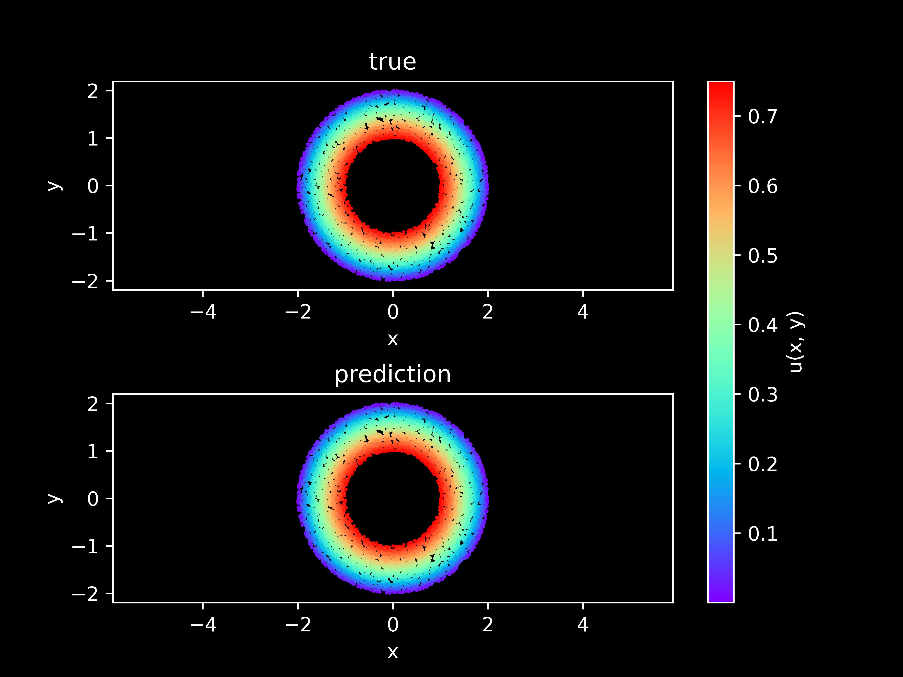

# 基于PINNs的泊松方程（Poisson' equation）求解

## 概述

泊松方程是一个在理论物理中具有广泛效用的椭圆偏微分方程。例如，泊松方程的解是由给定电荷或质量密度分布引起的势场；在已知势场的情况下，人们可以计算静电场或引力（力）场。

## 问题描述

从一个二维齐次泊松方程出发：

$$
f + \Delta u = 0
$$

其中`u`是因变量，`f`是源项，$\Delta$表示拉普拉斯算子。
我们考虑源项（$f=1.0$），泊松方程可以表示如下：

$$
\frac{\partial^2u}{\partial x^2} + \frac{\partial^2u}{\partial y^2} + 1.0 = 0,
$$

本案例中，我们使用狄利克雷边界条件和诺曼边界条件。具体表示如下：

内圈采用狄利克雷边界条件：
$$
u = 0
$$

外圈采用诺曼边界条件：
$$
du/dn = 0
$$

本案例利用PINNs方法学习$(x, y) \mapsto u$，实现泊松方程的求解。

## 技术路径

MindFlow求解该问题的具体流程如下：

1. 创建训练数据集。
2. 构建神经网络。
3. 问题建模。
4. 模型训练。
5. 模型推理及可视化。

## 创建数据集

本案例根据求解域、初始条件及边值条件进行随机采样，生成训练数据集与测试数据集，具体设置如下：

```python
from src import create_training_dataset

dataset = create_training_dataset(config)
train_dataset = dataset.batch(batch_size=config["train_batch_size"])
```

## 构建神经网络

本例使用简单的全连接网络，深度为6层，激发函数为`tanh`函数。

```python
from mindflow import MultiScaleFCCell

model = MultiScaleFCCell(in_channels=2,
                         out_channels=1,
                         layers=6,
                         neurons=128,
                         residual=False,
                         act='tan',
                         num_scales=1)

# define optimizer
optimizer = nn.Adam(model.trainable_params(), config["optimizer"]["initial_lr"])
```

## 问题建模

`Poisson`包含求解问题的控制方程、狄利克雷边界条件、诺曼边界条件等。使用`sympy`以符号形式定义偏微分方程并求解所有方程的损失值。

```python
from mindflow.pde import Poisson, sympy_to_mindspore

class Poisson2D(Poisson):
    def __init__(self, model, loss_fn=nn.MSELoss()):
        super(Poisson2D, self).__init__(model, loss_fn=loss_fn)
        self.bc_outer_nodes = sympy_to_mindspore(self.bc_outer(), self.in_vars, self.out_vars)
        self.bc_inner_nodes = sympy_to_mindspore(self.bc_inner(), self.in_vars, self.out_vars)

    def bc_outer(self):
        bc_outer_eq = self.u
        equations = {"bc_outer": bc_outer_eq}
        return equations

    def bc_inner(self):
        bc_inner_eq = sympy.Derivative(self.u, self.normal) - 0.5
        equations = {"bc_inner": bc_inner_eq}
        return equations

    def get_loss(self, pde_data, bc_outer_data, bc_inner_data, bc_inner_normal):
        pde_res = self.parse_node(self.pde_nodes, inputs=pde_data)
        pde_loss = self.loss_fn(pde_res[0], Tensor(np.array([0.0]), mstype.float32))

        bc_inner_res = self.parse_node(self.bc_inner_nodes, inputs=bc_inner_data, norm=bc_inner_normal)
        bc_inner_loss = self.loss_fn(bc_inner_res[0], Tensor(np.array([0.0]), mstype.float32))

        bc_outer_res = self.parse_node(self.bc_outer_nodes, inputs=bc_outer_data)
        bc_outer_loss = self.loss_fn(bc_outer_res[0], Tensor(np.array([0.0]), mstype.float32))

        return pde_loss + bc_inner_loss + bc_outer_loss
```

## 模型训练

使用2.0.0及以后版本的MindSpore，采用函数式编程的方式训练网络。

```python
def train():
    problem = Poisson2D(model)

    def forward_fn(pde_data, bc_outer_data, bc_inner_data, bc_inner_normal):
        loss = problem.get_loss(pde_data, bc_outer_data, bc_inner_data, bc_inner_normal)
        return loss

    grad_fn = ops.value_and_grad(forward_fn, None, optimizer.parameters, has_aux=False)

    @jit
    def train_step(pde_data, bc_outer_data, bc_inner_data, bc_inner_normal):
        loss, grads = grad_fn(pde_data, bc_outer_data, bc_inner_data, bc_inner_normal)
        loss = ops.depend(loss, optimizer(grads))
        return loss

    steps = config["train_steps"]
    sink_process = ms.data_sink(train_step, train_dataset, sink_size=1)
    model.set_train()
    for step in range(steps):
        local_time_beg = time.time()
        cur_loss = sink_process()
        if step % 100 == 0:
            print(f"loss: {cur_loss.asnumpy():>7f}")
            print("step: {}, time elapsed: {}ms".format(step, (time.time() - local_time_beg) * 1000))
            calculate_l2_error(model, inputs, label, config["train_batch_size"])

time_beg = time.time()
train()
print("End-to-End total time: {} s".format(time.time() - time_beg))
```

模型结果如下：

```python
loss: 0.000145
step: 4600, time elapsed: 322.16882705688477ms
    predict total time: 7.802009582519531 ms
    l2_error:  0.015489169733942706
==================================================================================================
loss: 0.000126
step: 4700, time elapsed: 212.70012855529785ms
    predict total time: 1.6586780548095703 ms
    l2_error:  0.009361597111586684
==================================================================================================
loss: 0.000236
step: 4800, time elapsed: 215.49749374389648ms
    predict total time: 1.7461776733398438 ms
    l2_error:  0.02566272469054492
==================================================================================================
loss: 0.000124
step: 4900, time elapsed: 256.4735412597656ms
    predict total time: 55.99832534790039 ms
    l2_error:  0.009129306458721625
==================================================================================================
End-to-End total time: 1209.8912012577057 s
```

## 模型推理及可视化

训练后可对流场内所有数据点进行推理，并可视化相关结果。

```python
from src import visual_result

visual_result(model, inputs, label, config["train_steps"]+1)
```


