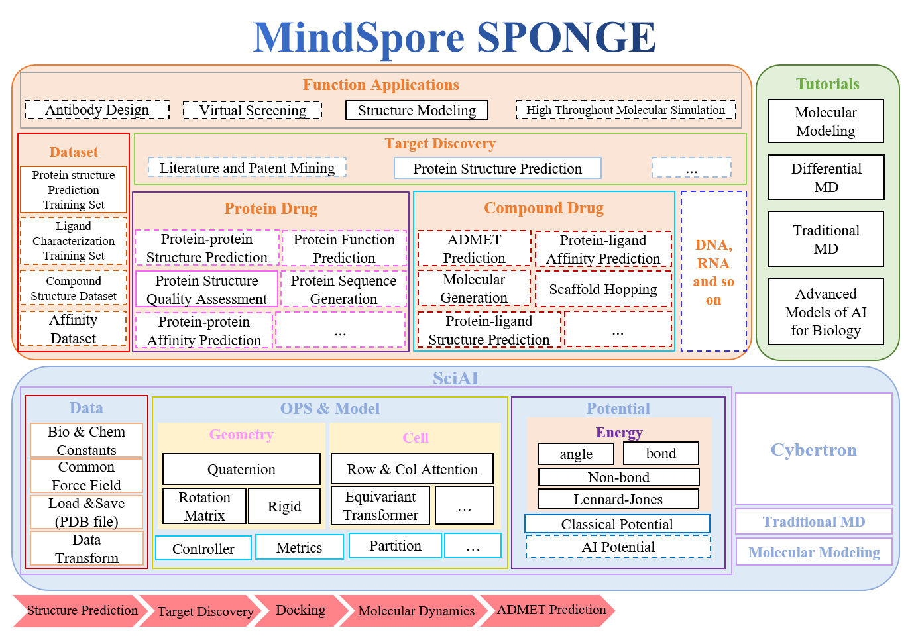

[](https://pypi.org/project/mindspore)
[](https://badge.fury.io/py/mindspore)
[](https://github.com/mindspore-ai/mindspore/blob/master/LICENSE)
[](https://gitee.com/mindspore/mindscience/pulls)
# MindSPONGE

<!-- TOC -->

- [MindSPONGE](#mindsponge)
    - [MindSPONGE介绍](#mindsponge介绍)
    - [最新消息](#最新消息)
    - [初体验](#初体验)
    - [安装教程](#安装教程)
        - [硬件支持情况](#硬件支持情况)
        - [pip安装](#pip安装)
            - [源码安装](#源码安装)
    - [社区](#社区)
        - [SIG](#sig)
        - [合作者](#合作者)
    - [许可证](#许可证)

<!-- TOC -->

## MindSPONGE介绍

MindSPONGE(Simulation Package Of Next GEneration molecular modelling)是基于[昇思MindSpore](https://www.mindspore.cn/)的计算生物领域套件，支持分子动力学、蛋白质折叠等常用功能，旨在于为广大的科研人员、老师及学生提供高效易用的AI计算生物软件。



## 最新消息

- 2022.06.27 [发布首个百万级开源蛋白质结构训练数据集PSP](https://arxiv.org/pdf/2206.12240v1.pdf)
- 2022.04.21 [CAMEO竞赛月榜第一](https://www.huawei.com/cn/news/2022/4/mindspore-cameo-protein-ascend)

## 初体验

- PSP数据集加载

```bash
```

- 蛋白质 violation 计算
    ###### 使蛋白质推理模型预测的pdb虽然在绝大多数原子上都准确预测出理想的键长和键角，然而原子间是否存在冲突以及肽键信息对于真实结构也尤为重要，violation 则计算了预测pdb的总原子间冲突程度以及肽键键长键角是否满足一定的限制条件。该计算数值对于评估预测蛋白质结构是否合理以及后续做蛋白质relax尤其重要

```bash
from mindsponge.core.loss import get_violation_loss
violation, _ = get_violation_loss(pdb_path)
```

- 四元数与旋转矩阵转换

```bash
```

- 简单体系分子模拟

```bash
```

- Amber文件加载

```bash
```

更多应用案例请见：

- [蛋白质结构松弛](https://gitee.com/izayoi16/mindscience/blob/dev-md/MindSPONGE/applications/molecular_dynamics/protein_relax/protein_relax_pipeline.py)
- [蛋白质结构预测]()
- [蛋白质结构质量评估]()
- [MSA引擎]()
- 分子对接打分(TO BE DONE)
- 基于功能的蛋白设计(TO BE DONE)
- 基于结构的蛋白设计(TO BE DONE)
- 蛋白质功能预测(TO BE DONE)
- 化合物分子表征模型(TO BE DONE)

## 安装教程

- 依赖包

```bash
numpy
biopython
```

### 硬件支持情况

| 硬件平台      | 操作系统        | 状态  |
| :------------ | :-------------- | :--- |
| Ascend 910    | Ubuntu-x86      | ✔️   |
|               | Ubuntu-aarch64  | ✔️   |
|               | EulerOS-aarch64 | ✔️   |
|               | CentOS-x86      | ✔️   |
|               | CentOS-aarch64  | ✔️   |
| GPU CUDA 10.1 | Ubuntu-x86      | ✔️   |

### pip安装

- whl包获取路径

```bash
pip install mindsponge-*.whl
```

#### 源码安装

```bash
git clone https://gitee.com/mindspore/mindscience.git
cd {PATH}/MindScience/MindSPONGE
bash build.sh -e [gpu|ascend]
cd build
pip install ./whl/mindsponge-*.whl
```

## 社区

### SIG

查看MindSpore如何进行[开放治理](https://gitee.com/mindspore/community/blob/master/governance.md)。

### 合作者

- [高毅勤课题组]()

## 许可证

[Apache License 2.0](LICENSE)
