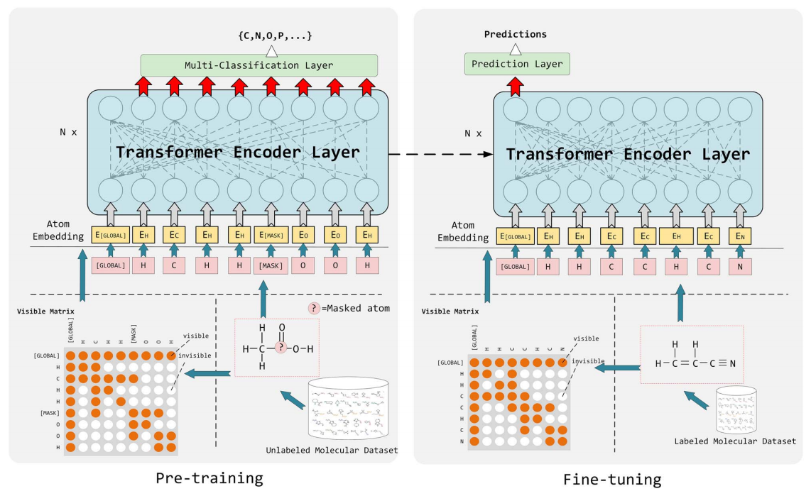

# Molecular-graph-BERT

MG-BERT is used for leveraging unsupervised atomic representation learning for molecular property prediction. We provide scripts for 3 works: 1) pretrain the masked atoms prediction; 2) classification; 3) regression.



## Environment

This project is run on Nvidia RTX3090 and adopts Mindspore framework. This project can deploy in other hardware environments by configuring its own environment.

The version of the environment used in this project is:

mindspore-gpu 1.8.0；

python 3.7；

## Code organization

- src：data processing and model scripts;
- pretrain：contains the codes for masked atom prediction pre-training task.;
- classification ：contains the code for fune-tuning on specified classification tasks;
- regression：contains the code for fune-tuning on specified regression tasks.

## Conda environment configuration

It is highly recommended to start a new conda environment.

To set up a new conda environment with required packages,

```text
conda create -n inverse python=3.7
conda activate inverse
conda install mindspore-gpu=1.8.1 cudatoolkit=11.1 -c mindspore -c conda-forge
conda install -c openbabel openbabel
```

## Quickstart

### Pre-training for masked atom prediction

In the pretraining stage, we took advantage of a large number of unlabeled molecules to mine context information in molecules，which can be pre-trained with the following command：

```text
python pretrain.py --path='data/chembl_31_chemreps.txt' --trained_epoch=100 --vocab_size=17
```

### Classification

To predict and classify molecular properties for different tasks, use the `classfication.py` script.

For example, you can use the following command to classify 'Pgp_sub' tasks:

```text
python classfication.py --task='Pgp_sub' --pretraining=0 --trained_epoch=100 --vocab_size=17
```

### Regression

To perform molecular property regression prediction for different tasks, use the `regression.py` script.

For example, you can use the following command for 'logS' task regression prediction:

```text
python regression.py --task='logS' --pretraining=0 --trained_epoch=100 --vocab_size=17
```

## Data

The data used in the pretraining stage were obtained from the CHeMBL database, and 1.7 million compounds in the database were randomly selected as training data. In the fine-tuning stage, sixteen datasets (eight for regression and eight for classification) covering critical ADMET endpoints and various common molecular properties were collected from the ADMETlab and MoleculeNet to train and evaluate MG-BERT.

The data used for pretraining is available through the chembl_31_chemreps.txt.gz in the following links:

- https://ftp.ebi.ac.uk/pub/databases/chembl/ChEMBLdb/latest/

The data used for regression and classification can be obtained through the following link:

- https://gitee.com/lytgogogo/project_data/tree/master/data
