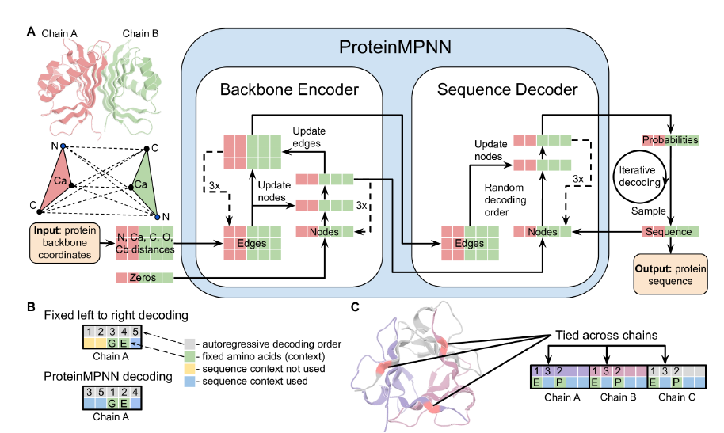

# ProteinMPNN

## Introduction

The code of ProteinMPNN is implemented by MindSpore. ProteinMPNN is a deep learning based protein sequence design method that is widely applicable to current design challenges and shows outstanding performance in experimental tests. ProteinMPNN utilizes that amino acid sequence at different positions can be coupled between single or multiple chains, enabling application to a wide range of current protein design. It is widely used in the design of monomers, cyclic oligomers, protein nanoparticles, and protein-protein interfaces. It adopts message passing neural network (MPNN) with 3 encoder and 3 decoder layers and 128 hidden dimensions to predict protein sequences in an autoregressive manner from N to C terminus using protein backbone features – distances between Ca-Ca atoms, relative Ca-Ca-Ca frame orientations and rotations, and backbone dihedral angles–as input.

The reference paper is [Robust deep learning based protein sequence design using ProteinMPNN](http://www.biorxiv.org/content/10.1101/2022.06.03.494563v1)

## Environment

This project is run on the NVIDIA RTX3090 and Ascend 910 computing platforms and adopts Mindspore framework. This project can deploy in different hardware environments by configuring its own environment.

The version of the environment used in this project is:

mindspore-gpu 1.8.0；

mindspore-ascend 1.9.0；

python 3.8；

## Code organization

- src：data processing, model and tool scripts;
- train.py: Model training script;
- eval.py：Model inference script;
- example_bash： Simple examples to run the code;
- ascend310_infer：Ascend 310 inference script.

## conda environment configuration

```conda
- conda create --name proteinmpnn
- conda activate proteinmpnn
- conda install mindspore-ascend=1.9.0 -c mindspore -c conda-forge
```

## Dataset

In this project, multi-chain training data (16.5GB, PDB biounits, 2021 August 2) is used to train the model, The dataset can be downloaded via a link[multi-chain training data](https://files.ipd.uw.edu/pub/training_sets/pdb_2021aug02.tar.gz). In order to facilitate the analysis of training data, this project provides pre-processed training data[parsed training data](https://pan.baidu.com/s/1pbJNaADmO_mOuVTo5KqE4Q?pwd=xfrp). For model inference tasks, this project provides examples of data pdb files and corresponding parsed jsonl files for model inference[PDB_monomers](https://gitee.com/bling__bling/protein-mpnn/tree/master/datasets/PDB_monomers), [PDB_homooligomers](https://gitee.com/bling__bling/protein-mpnn/tree/master/datasets/PDB_homooligomers) and [
PDB_complexes](https://gitee.com/bling__bling/protein-mpnn/tree/master/datasets).

## Run

### training

```text
python eval.py --path_to_model_weights "model_weights" --model_name "pretrained_model_020" --save_score 0 --save_probs 0 --score_only 0 --conditional_probs_only 0 --conditional_probs_only_backbone 0 --unconditional_probs_only 0 --num_seq_per_target 2 --batch_size 1 --sampling_temp "0.1" --out_folder 'PDB_monomers/example_1_outputs' --jsonl_path 'PDB_monomers/example_1_outputs/parsed_pdbs.jsonl' --device_id 0
```

This project provides pre-training model file, which can be downloaded through the link [pretrained model weights](https://gitee.com/bling__bling/protein-mpnn/tree/master/checkpoint) for model inference, model deployment and other tasks.

### Inference

```text
python eval.py --path_to_model_weights "model_weights" --model_name "pretrained_model_020" --save_score 0 --save_probs 0 --score_only 0 --conditional_probs_only 0 --conditional_probs_only_backbone 0 --unconditional_probs_only 0 --num_seq_per_target 2 --batch_size 1 --sampling_temp "0.1" --out_folder 'PDB_monomers/example_1_outputs' --jsonl_path 'PDB_monomers/example_1_outputs/parsed_pdbs.jsonl' --device_id 0
```

This project provides eight different example inference tasks. The bash script for executing the command is stored in./example_bash/.

Example input parameters to the inference script `eval.py`:

```python
- argparser.add_argument("--path_to_model_weights", type=str, default="vanilla_model_weights", help="Path to model weights folder;")
- argparser.add_argument("--model_name", type=str, default="v_48_020",help="ProteinMPNN model name: v_48_002, v_48_010, v_48_020, v_48_030; v_48_010=version with 48 edges 0.10A noise")
- argparser.add_argument("--save_score", type=int, default=0, help="0 for False, 1 for True; save score=-log_prob to npy files")
- argparser.add_argument("--save_probs", type=int, default=0, help="0 for False, 1 for True; save MPNN predicted probabilities per position")
- argparser.add_argument("--score_only", type=int, default=0, help="0 for False, 1 for True; score input backbone-sequence pairs")
- argparser.add_argument("--conditional_probs_only", type=int, default=0, help="0 for False, 1 for True; output conditional probabilities p(s_i given the rest of the sequence and backbone)")
- argparser.add_argument("--conditional_probs_only_backbone", type=int, default=0, help="0 for False, 1 for True; if true output conditional probabilities p(s_i given backbone)")
- argparser.add_argument("--unconditional_probs_only", type=int, default=0, help="0 for False, 1 for True; output unconditional probabilities p(s_i given backbone) in one forward pass")
- argparser.add_argument("--backbone_noise", type=float, default=0.00, help="Standard deviation of Gaussian noise to add to backbone atoms")
- argparser.add_argument("--num_seq_per_target", type=int, default=2, help="Number of sequences to generate per target")
- argparser.add_argument("--batch_size", type=int, default=1, help="Batch size; can set higher for titan, quadro GPUs, reduce this if running out of GPU memory")
- argparser.add_argument("--max_length", type=int, default=20000, help="Max sequence length")
- argparser.add_argument("--sampling_temp", type=str, default="0.1", help="A string of temperatures, 0.2 0.25 0.5. Sampling temperature for amino acids, T=0.0 means taking argmax, T>>1.0 means sample randomly. Suggested values 0.1, 0.15, 0.2, 0.25, 0.3. Higher values will lead to more diversity.")
- argparser.add_argument("--out_folder", type=str, default='PDB_monomers/example_1_outputs', help="Path to a folder to output sequences.")
- argparser.add_argument("--pdb_path", type=str, default='', help="Path to a single PDB to be designed")
- argparser.add_argument("--pdb_path_chains", type=str, default="", help="Define which chains need to be designed for a single PDB ")
- argparser.add_argument("--jsonl_path", type=str, default='PDB_monomers/example_1_outputs/parsed_pdbs.jsonl', help="Path to a folder with parsed pdb into jsonl")
- argparser.add_argument("--chain_id_jsonl", type=str, default='', help="Path to a dictionary specifying which chains need to be designed and which ones are fixed, if not specified all chains will be designed.")
- argparser.add_argument("--fixed_positions_jsonl", type=str, default='', help="Path to a dictionary with fixed positions.")
- argparser.add_argument("--omit_AAs", type=list, default='X', help="Specify which amino acids should be omitted in the generated sequence, e.g. 'AC' would omit alanine and cystine.")
- argparser.add_argument("--bias_AA_jsonl", type=str, default='', help="Path to a dictionary which specifies AA composion bias if neededi, e.g. {A: -1.1, F: 0.7} would make A less likely and F more likely.")
- argparser.add_argument("--bias_by_res_jsonl", default='', help="Path to dictionary with per position bias.")
- argparser.add_argument("--omit_AA_jsonl", type=str, default='', help="Path to a dictionary which specifies which amino acids need to be omitted from design at specific chain indices")
- argparser.add_argument("--pssm_jsonl", type=str, default='', help="Path to a dictionary with pssm")
- argparser.add_argument("--pssm_multi", type=float, default=0.0, help="A value between [0.0, 1.0], 0.0 means do not use pssm, 1.0 ignore MPNN predictions")
- argparser.add_argument("--pssm_threshold", type=float, default=0.0, help="A value between -inf + inf to restric per position AAs")
- argparser.add_argument("--pssm_log_odds_flag", type=int, default=0, help="0 for False, 1 for True")
- argparser.add_argument("--pssm_bias_flag", type=int, default=0, help="0 for False, 1 for True")
- argparser.add_argument("--tied_positions_jsonl", type=str, default='', help="Path to a dictionary with tied positions")
- argparser.add_argument('--device_target', help='device target', type=str, default="GPU")
- argparser.add_argument('--device_id', help='device id', type=int, default=0)
```

Example of running the inference script. To run the inference script of example 1:

```text
- cd /root/ProteinMPNN
- bash example_bash/submit_example_1.sh
```

The output of example 1 is as follows:

```text
>5L33, score=1.6066, fixed_chains=[], designed_chains=['A'], model_name=v_48_020, git_hash=unknown
HMPEEEKAARLFIEALEKGDPELMRKVISPDTRMEDNGREFTGDEVVEYVKEIQKRGEQWHLRRYTKEGNSWRFEVQVDNNGQTEQWEVQIEVRNGRIKRVTITHV
>T=0.1, sample=0, score=0.7977, seq_recovery=0.4528
SIDEEEKKALDFIEALEKADPELMAKVITPDTEMEVNGKKYKGEEIVEFVKKLAEEGVKYKLKSYKKEGDKYVFTVEKSKDGKTKTVTITVEVKDGKVKEIKIEEK
>T=0.1, sample=0, score=0.8433, seq_recovery=0.4434
SVDEDTKKALDFIKALEEADPELMKKVITPDTKMTVNGKEYKGEEIVDFVKELKKKGVKYTLKSYKKEGDKYVFTVTKSYNGKTYTITIEIEVKDGKVEKIVITEN
```