# **MindSpore SPONGE暑期学校新手教程**

## **注册账号**

提前注册[Gitee账号](https://gitee.com/)与[华为云账号](https://activity.huaweicloud.com/)，华为云账户需实名认证。

## **Fork代码仓**

Gitee搜索mindscience，点击右上角的Fork按钮，在自己的代码仓里加入mindscience代码仓分支


进入自己的仓库界面，点击mindscience仓（以个人代码仓为例）


点击**克隆/下载**，再点击**复制**，获取gitee链接
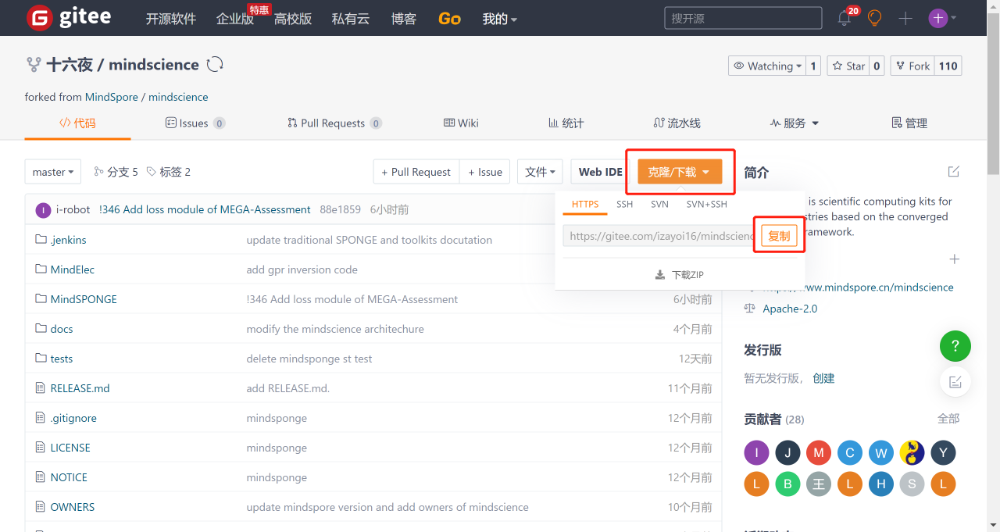

## **代金券申请**

登录华为云账号，点击**控制台**按钮进入控制台


记录右上角账号名称


如果账号页面如下图所示，账号名为租户名


通过填写问卷将**账号名**反馈给助手，等待一定时间后，即可获得每日发放代金券。(每日共500份)

代金券发放后，控制台内点击右侧费用中心，即可看到已发放代金券详情。
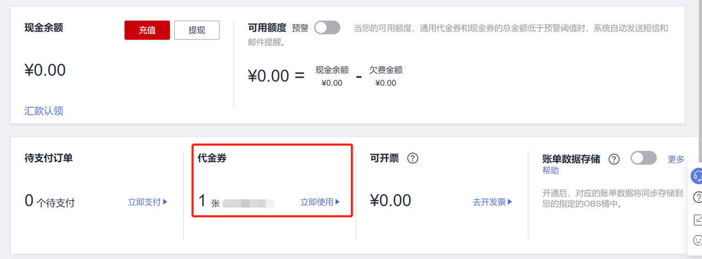

## **AK/SK获取**

在控制台中点击**我的凭证**后，在左侧点击**访问密钥**，再点击**新增访问密钥**


完成身份验证显示创建成功后点击**立即下载**获得AK/SK的excel表格。


表格中的Access Key Id与Secret Access Key即为所需AK/SK。

## **obs桶创建**

在控制台界面我的导航处或服务搜索处点击**对象储存服务obs**


左侧点击**桶列表**后右侧点击**创建桶**，新建obs桶。
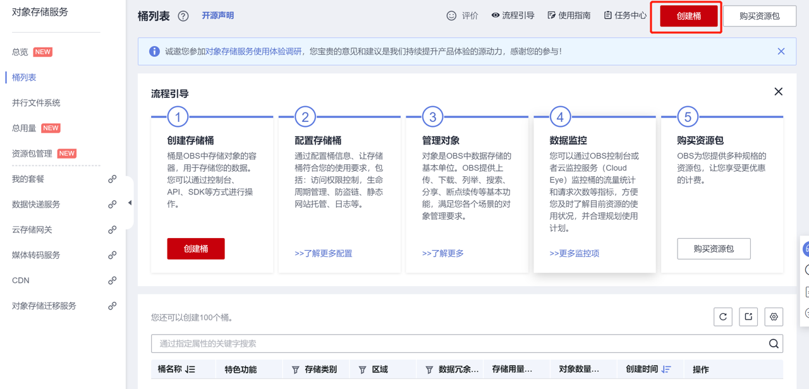

选择合适的区域与自己的桶名称，数据冗余存储策略选择**单AZ存储**后点击立即创建，obs桶创建完成。
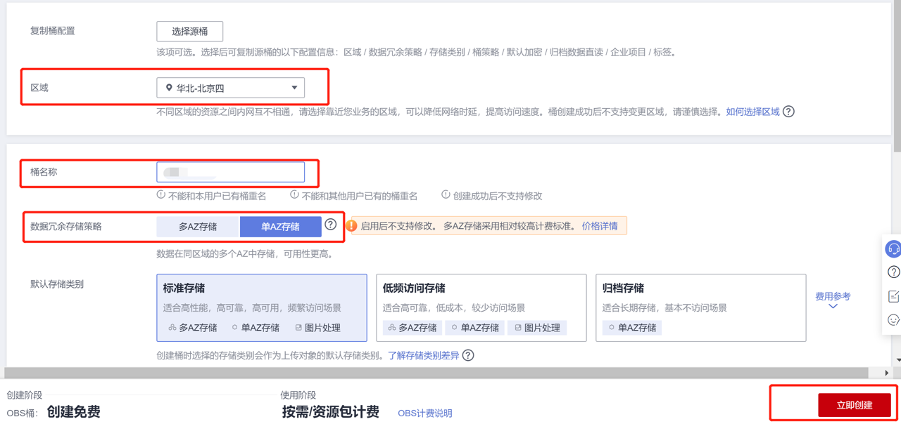

### **资源包购买**

在创建obs桶界面右侧点击**购买资源包**


区域选择与资源包类型选择和**obs桶所选择区域保持一致！**
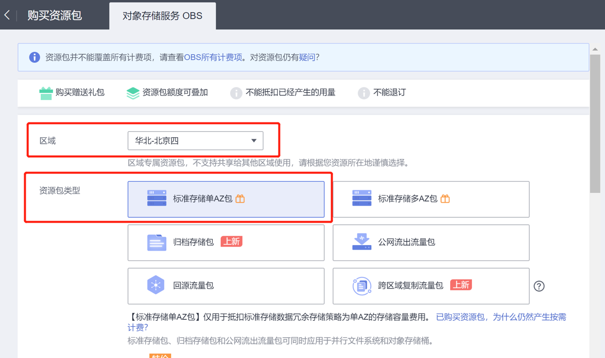

规格选择40GB，购买时长为1个月后加入清单完成购买。
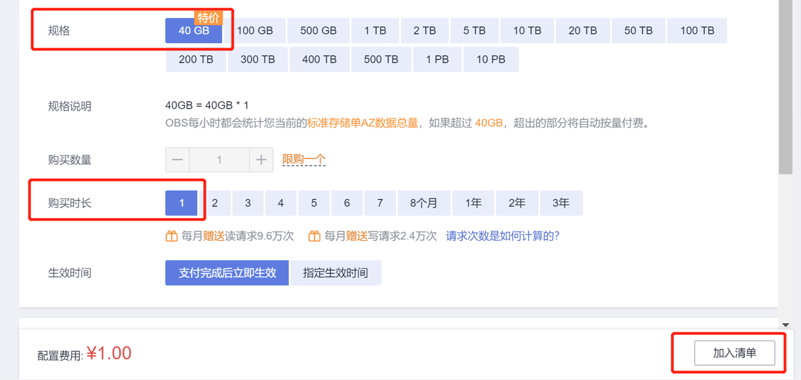

付款时可使用已发送代金券进行支付。
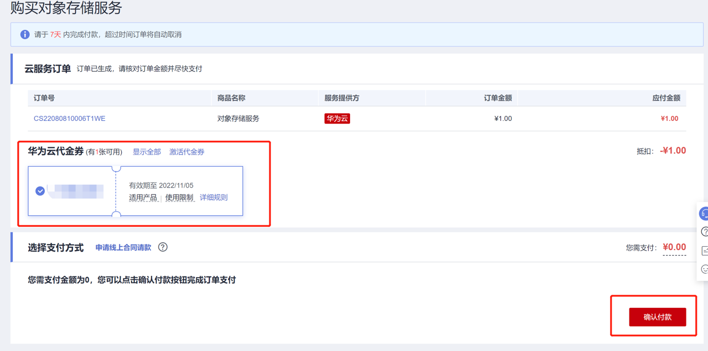

支付完成即可完成obs桶的创建与资源包购买


## **obs桶数据迁移**

为了获取上课所需数据集与安装包，需要通过obs桶数据迁移从别的桶中拷贝数据。

在控制台界面左侧搜索**OMS**，选择对象存储迁移服务OMS


右侧点击创建迁移任务


选择源端桶，填入源端桶的访问密钥，私有访问密钥与桶名称
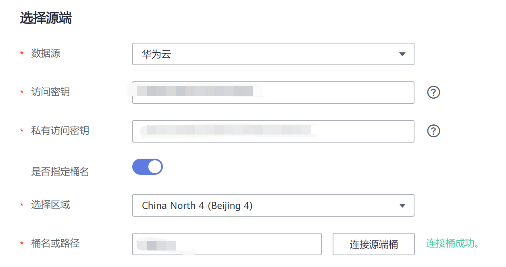

```bash
BRBV0HWVJYAZIOXI1RGT #访问密钥
ZK0AAgUq9QZWYO0tYlxGqrNyqZC15eSJdT3bLwlf #私有访问密钥
yhding #桶名称
```

选择目的端桶，访问密钥为刚才所获取的AK，私有访问密钥为刚才获取的SK，输入后点击连接目的端桶
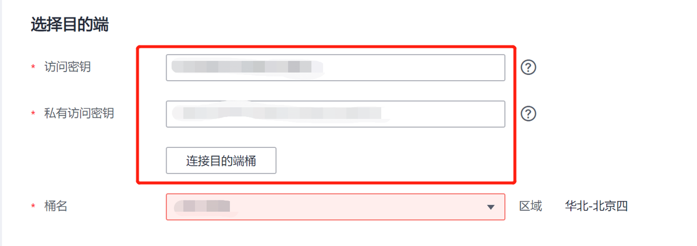

如图设置后点击下一步，再点击开始迁移


迁移完成
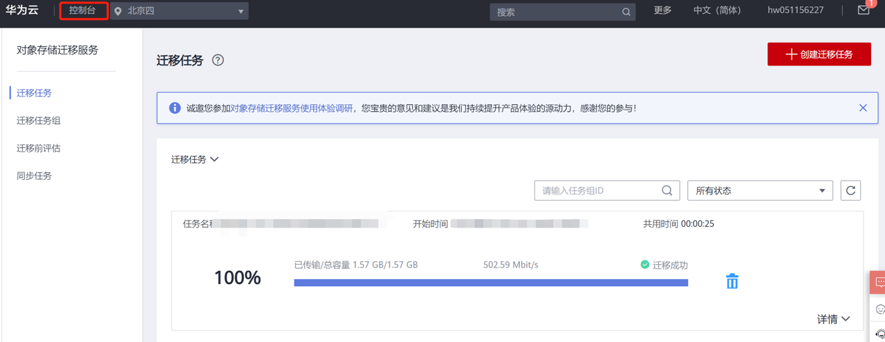

## **上机环境创建**

控制台界面顶部搜索ModelArts


点击进入控制台


左侧点击开发环境的Notebook，获取依赖服务授权。
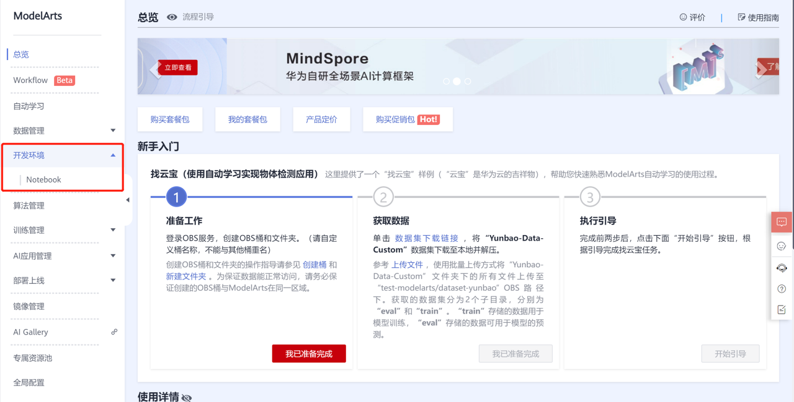


按照如图所示进行授权，默认已有名称可不做修改


获得授权后进行Notebook的创建


自定义命名与自动停止时间。Notebook为按时长收费，扣费自动使用已发放代金券，所以一定要**设定自动停止时间，并且在结束上机后及时停止！**


选择公共镜像，因为本次上机所使用为GPU，因此要选择有**MindSpore和cuda10.1**的镜像，如图所示
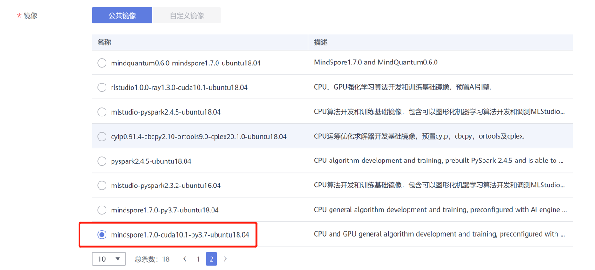

**规格与存储配置按照如图配置选择**，选择完成后点击立即创建再点击提交即可
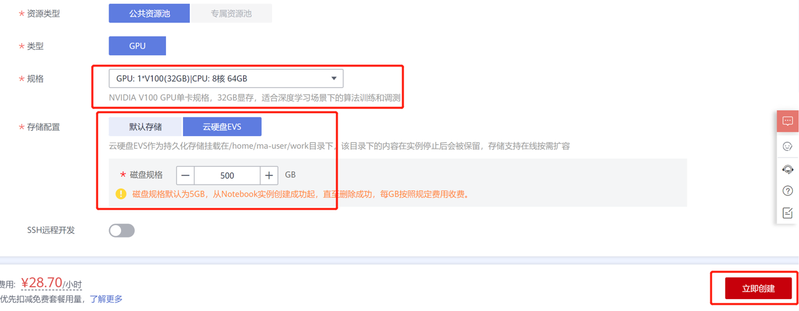

创建完成后在Notebook界面点击打开进入运行界面，Notebook界面如图所示


点击左侧第六个按钮进行git clone，输入之前复制所得gitee链接获得mindscience仓代码


点击左侧第四个按钮进行文件上传


在上传界面选择从obs桶上传，之后选择桶中的所有文件进行上传
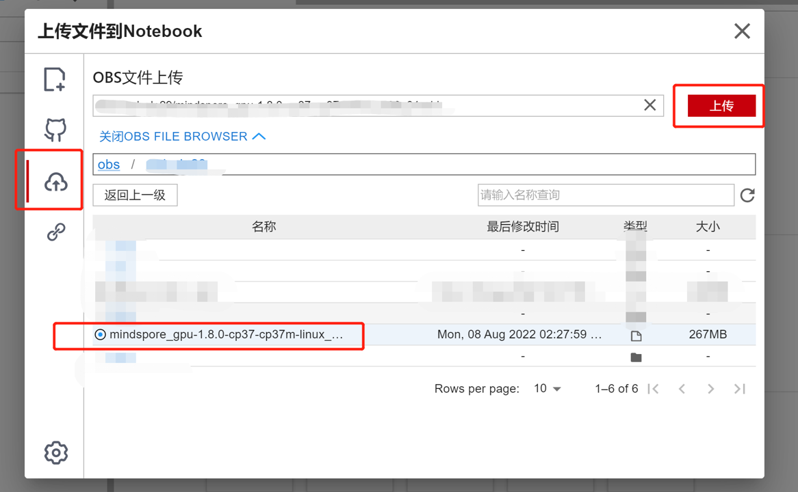

完成上传后打开terminal进行环境的配置
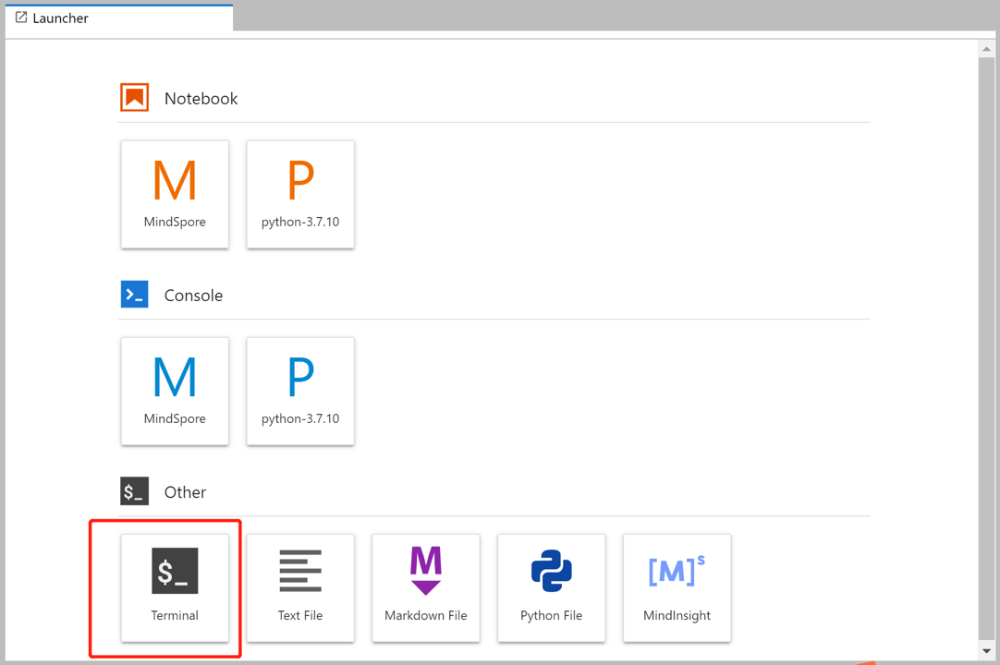

在终端依次执行如下命令

```bash
pip install mindspore_gpu-1.8.0-cp37-cp37m-linux_x86_64.whl
pip install h5py -i https://pypi.tuna.tsinghua.edu.cn/simple/
cd mindscience/MindSPONGE/
pip install -r requirements.txt
bash build.sh -e gpu -j32 -t on -c on
cd output/
pip install mindscience_sponge_gpu-0.1.0rc1-py3-none-any.whl
pip install mindscience_cybertron-0.1.0rc1-py3-none-any.whl
```

环境配置完成